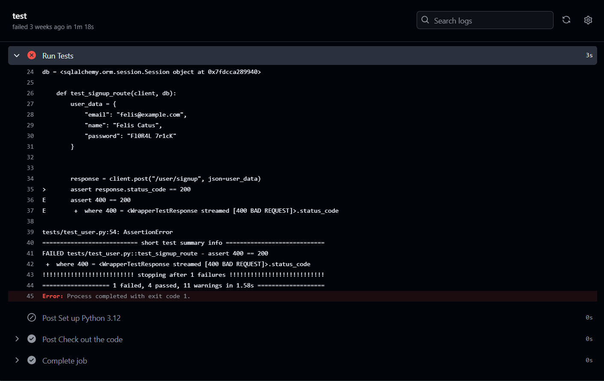

# Hito 2: Integración continua

## Objetivo
El objetivo de este hito es implementar pruebas y la infraestructura de integración continua (CI) necesaria para asegurar la correcta operación de las funcionalidades básicas de los modelos de la aplicación.

## Implementación de entorno de CI en GitHub
He utilizado un archivo `python-app.yml` (localización: `CC-backend/.github/workflows/python-app.yml`) que ejecuta un workflow cada vez que se recibe un Push o PR a la rama master (aunque este último no vaya a ocurrir, al menos en el desarrollo inmediato de este proyecto). El trabajo que se realiza es montar una máquina con las dependencias necesarias para ejecutar los tests. Una vez se realizan los tests, se eliminan los recursos asociados y se envían los mensajes correspondientes.

En caso de que los tests se ejecuten sin problemas, en el apartado Actions se puede ver algo así: 

En cambio, si hay algún error, se verá en el apartado Actions algo así:

Si entramos en el run, veremos algunos detalles más, como el código de error o el resultado de ejecución.

## Tests realizados
Para garantizar la calidad y estabilidad del código en un entorno de desarrollo ágil, 
he implementado una serie de tests usando Pytest, que cubren las operaciones CRUD básicas de 
los principales modelos: `Usuario`, `Asignatura`, `Nodo`, `Pregunta`, y `Examen`. Estas pruebas 
permiten verificar que cada operación de `Post`, `Get`, `Update` y `Delete` básica 
funcione de acuerdo a lo esperado, para evitar errores en caso de cambios en el código.

Debido a la modularidad de la aplicación, la mayoría de modelos cuentan con funciones parecidas,
que se pueden resumir en las siguientes:
   - `Crear Objeto del Modelo.` Dados los parámetros necesarios para la creación de un objeto, se comprueban, 
      se crea el objeto y se devuelve. Se ha comprobado que se ha podido crear el objeto y que tiene los parámetros dados
     (o, al menos, los que se esperan, como en el caso de la contraseña cifrada para el usuario).
   - `Obtener Objetos de un Usuario o Asignatura.` Dado el Identificador de un Usuario (en el caso del modelo Asignatura)
     o de una Asignatura (en el caso de Nodos, Preguntas y Exámenes), se devuelven todos los objetos que pertenezcan al
     Usuario/Asignatura. En el caso del Usuario, se obtienen los datos del Usuario. Se comprueba que los objetos recibidos
     son los esperados y los del Usuario.
   - `Editar Objeto del Modelo.` Dado el Identificador de un Objeto y nuevos datos para el mismo, se editan los datos
   del Objeto. Se comprueba que los datos cambiados son distintos y que los que no se cambian siguen igual. 
   - `Borrar Objeto.` Dado el Identificador de un Objeto, se borra el Objeto asociado. Se comprueba que no se devuelve nada.

## Conclusiones
Esta implementación de pruebas y configuración de CI sienta las bases para una integración continua eficaz, promoviendo 
un desarrollo de mayor calidad y limitando los errores para próximas fases.
