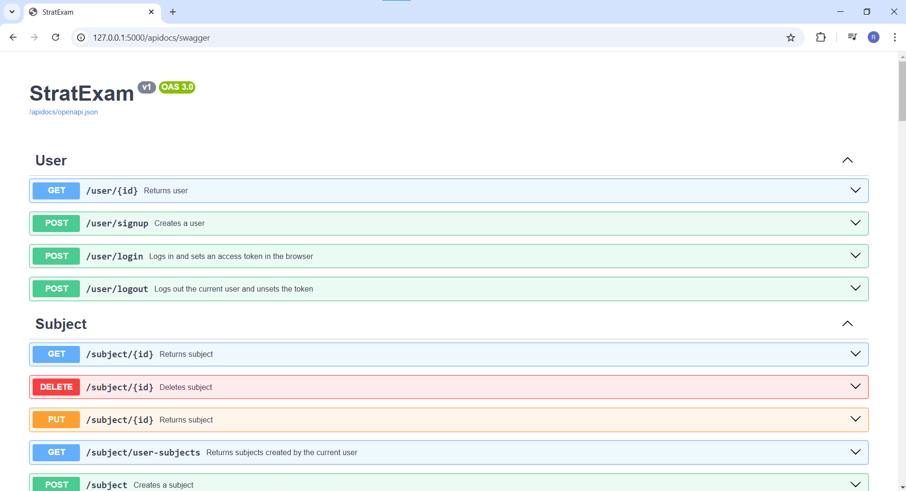
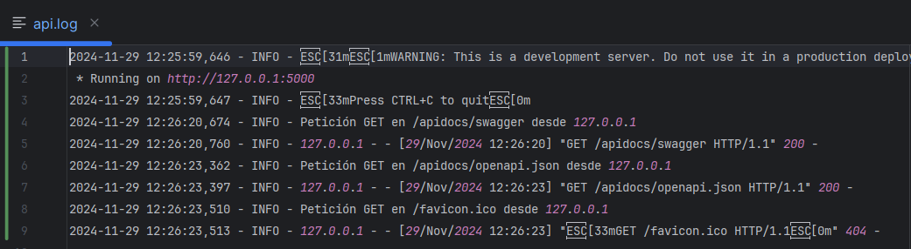
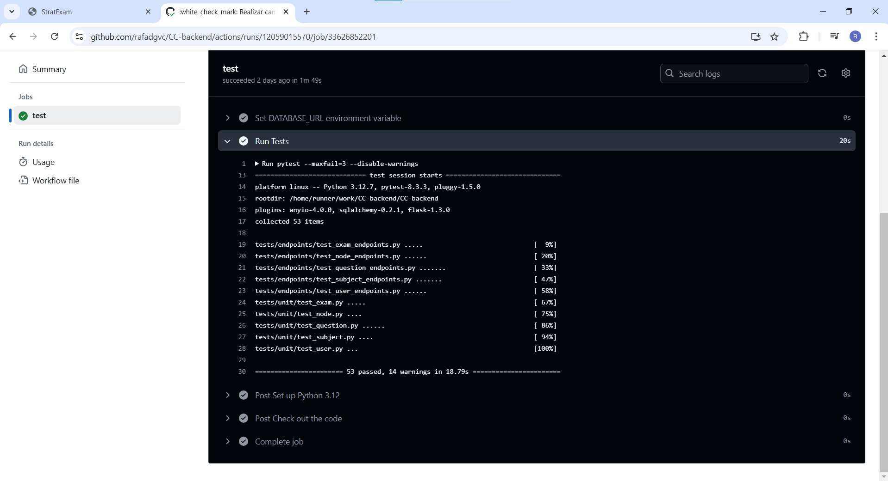

# Hito 3: Microservicios

## Objetivo
El objetivo de este hito es implementar una API para recibir peticiones de la plataforma, así como un sistema de logs 
para registrar las peticiones a la API, y los tests asociados a los endpoints creados. 

## Flask:
Aunque esta parte de la aplicación ya estaba implementada antes de iniciar esta parte del proyecto, se procederá a 
explicar brevemente el funcionamiento de Flask, así como las razones por las que se eligió en un principio.

Flask es una tecnología que sirve para generar un microservicio en Python que permite montar una API ligera basada en 
endpoints. El motivo de la elección de esta tecnología fue, entre otras razones, por su simpleza, fácil entendimiento y 
por familiaridad personalmente en proyectos anteriores.

Flask permite crear una serie de Blueprints, que sirven para designar una serie de endpoints que están agrupados. En el 
caso de esta API, los endpoints están agrupados por los modelos a los que se les aplica la operación. En su mayoría, se 
pueden observar para todos los Blueprints una serie de endpoints comunes:
- **Añadir Objeto**: añade un objeto al modelo. En el caso de **`Usuario`**, se trata más bien de un registro de Usuario.
- **Listar Objetos**: devuelve una lista de los objetos según un filtro; normalmente, de una **`Asignatura`** (**`Nodos`**, 
  **`Preguntas`**, **`Exámenes`**) o de un **`Usuario`** (**`Asignaturas`**). 
- **Obtener Objeto**: se obtiene un objeto concreto, según su ID.
- **Editar Objeto**: dados los atributos a cambiar, se edita el objeto al que se ha hecho referencia. No está disponible 
  para **`Usuario`**, **`Resultado`** o cualquier objeto que esté conectado (es decir, cualquier objeto que tenga un recurso asociado).
- **Borrar Objeto**: borra un objeto concreto de un modelo. No está disponible para **`Usuario`** o para objetos conectados.

Dentro de estos endpoints, cabe destacar algunos que son específicos de cada modelo:
- **Usuario**: como era de esperar, este es el modelo más distinto a los demás. Los endpoints que conforman su Blueprint son:
  - `/login`: inicia sesión para que el usuario pueda acceder a sus recursos.
  - `/logout`: cierra sesión.
- **Examen**: además de los mencionados, cabe destacar este:
  - `/select-questions`: dado una serie de parámetros (nodos de la jerarquía, preguntas a no seleccionar, dificultades, estimada, tiempo, estimado…) se devuelve un listado de las preguntas recomendadas a hacer. 

Para ver con más detalle todos los endpoints que se pueden utilizar, se puede acceder a la dirección **`/apidocs/swagger`**: 

## Sistema de Log:
La inclusión del sistema de Logs ha consistido en la incorporación de una función con el decorador de Flask **`before_request`**,
que permite hacer acciones antes de todas las peticiones que recibe la API. La función se llama **`log_request_info()`**, 
escribiendo el resultado de la petición a la API al archivo **`api.log`**, en vez de por la salida estándar (la consola). 
Aquí se puede ver un ejemplo de la petición a la API, en el log:

## Pytest:
De la misma manera que en el hito anterior, se han definido tests para probar los endpoints con Pytest. Los tests 
realizados en el hito anterior se encuentran ahora en **`/tests/unit`**, mientras que los de este hito se encuentran en 
**`/tests/endpoints`**. Para la mayoría de tests se han probado funcionalidades básicas, como las llamadas correctas al 
endpoint, además de llamadas erróneas esperadas del frontend de la aplicación, como sin autenticación o con datos no 
válidos o no existentes. Además, puesto que esta aplicación funcionaba inicialmente con un contenedor Docker (que se
monta con el archivo **`docker/db.docker-compose.yml`**), se ha incluido en las acciones de GitHub la creación de un 
contenedor Docker de la Base de Datos para todos los tests. Esto ha permitido que sea más fácil verificar la correcta 
ejecución de los tests en el CI:

