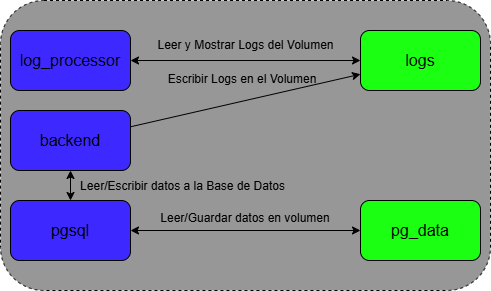

# Hito 4: Composición de servicios

## Objetivo

El objetivo de este hito es trasladar el proyecto a una arquitectura basada en contenedores, estableciendo
todos los servicios como un conjunto de contedores Docker que se comunican entre sí.

## Orquestación de servicios

El clúster tendría la siguiente estructura:

A la izquierda se pueden encontrar los tres Contenedores que componen el contenedor: `pgsql`, `backend` y 
`log_processor`, que tienen las funciones de gestionar la Base de Datos, manejar el backend y la 
lógica de negocio, y leer y mostrar los logs respectivamente. 

A la derecha, encontramos los volúmenes que se han generado para guardar la información del contenedor:
`logs` para almacenar todos los archivos de logs y `pg_data` para almacenar la Base de Datos de PosgreSQL. 

La orquestación de servicios se hace a través del archivo `docker-compose.yml`, que especifica las 
características que deben tener los contenedores que forman el proyecto, como el contexto en el que se
generan, la imagen de Docker que usan o las dependencias de unos contenedores con otros. 

Uno de los elementos comunes es la red compartida de Docker a través de la que se comunican los 
contenedores, la red `stratexam-network`, que permite comunicar los contenedores entre sí sin tener que 
exponer puertos para comunicaciones dentro del contenedor. En el diagrama, se puede ver representada la red
a través de las flechas negras. 

Por último, cada contenedor cuenta con un archivo `Dockerfile` para modularizar más las acciones a realizar
por cada contenedor.

## Contenedor 1: PosgreSQL (pgsql)

Este contenedor ya existía al inicio del proyecto, pero se explicará brevemente.

Este contenedor cuenta, como se puede inferir del título, con una base de datos de PosgreSQL. Esta permite
que se puedan guardar los datos que se especifiquen durante el uso de la aplicación. Se ha elegido
PosgreSQL porque se utiliza en muchos proyectos (lo que provoca que haya más documentación y soporte en
caso de ser necesario), por comodidad con el proyecto y por familiaridad personalmente. 

Para permitir esta persistencia de datos, se cuenta con un volumen, `pg_data`, para guardar los datos
incluso si se detiene el contenedor. Para configurar el contenedor, se hace uso también de un archivo `.env`
para establecer las variables de entorno sin alterar el código. 

El archivo `Dockerfile.db` establece un entrypoint en el que se llama al archivo `init.sql` para 
inicializar la base de datos en caso de que no esté creada. 

## Contenedor 2: Backend (backend)

Este contenedor encapsula todas las dependencias de la aplicación original, para que se pueda acceder a
traves de un navegador a `http://127.0.0.1:5000` como anteriormente. 

Para establecer todo lo necesario en el contenedor, se cuenta con el archivo `Dockerfile.backend` que
realiza las siguientes acciones:

- Establece `/backend` como la carpeta del contenedor en la que alojar todos los archivos.
- Crea el directorio y el archivo en el que se van a guardar los logs, y en el que va a escribir el logger.
- Copia e Instala todos los requerimientos necesarios de la aplicación.
- Copia todo el proyecto.
- Expone el puerto 5000 para que se puedan realizar peticiones HTTP desde un navegador. 
- Inicia la aplicación. 

## Contenedor 3: Procesador de Logs (log_processor)

Anteriormente, se guardaban los resultados de las peticiones HTTP en un archivo `api.log`. Ahora, se dedica
un contenedor `log_processor` para leerlos y guardarlos. Además, se ha añadido el volumen `logs`, dedicado
a guardar los archivos de logs. 

Se ha escogido un procesador de Fluentd, una herramienta de código abierot para recopilar, procesar y
almacenar logs. Las razones princiaples son el desacoplamiento con el backend (ya
que la solución anterior estaba muy condicionada por el backend, y con estos logs se muestran los mensajes
de todo tipo) y la flexibilidad (concretamente, para poder hacer cambios en el procesador sin afectar al 
código fuente, como por ejemplo cambiar a una solución más avanzada cmo ElasticSearch o Kibana).

Este contenedor también cuenta con un archivo `Dockerfile.logger` para su configuración, realizando lo
siguiente:

- Establece el directorio en el que se van a guardar y leer los logs, `/var/log/api/`.
- Instala las dependencias neesarias para procesar los logs en tiempo real. 
- Copia el archivo `fluent.conf` y establece las reglas para procesar los logs. 

El archivo `fluent.conf` establece cómo se deben procesar los logs. `@type tail`: Espera a leer los 
cambios que se le hacen al archivo en `path`, en este caso, `/var/log/api/api.log`. Además, en el archivo
`/var/log/api/api.pos` se guarda la posición actual para evitar releer líneas. Finalmente, establece como 
tag de los mensajes `api.logs`. Cuando encuentra un nuevo mensaje a leer, lo muestra por la salida estándar.

