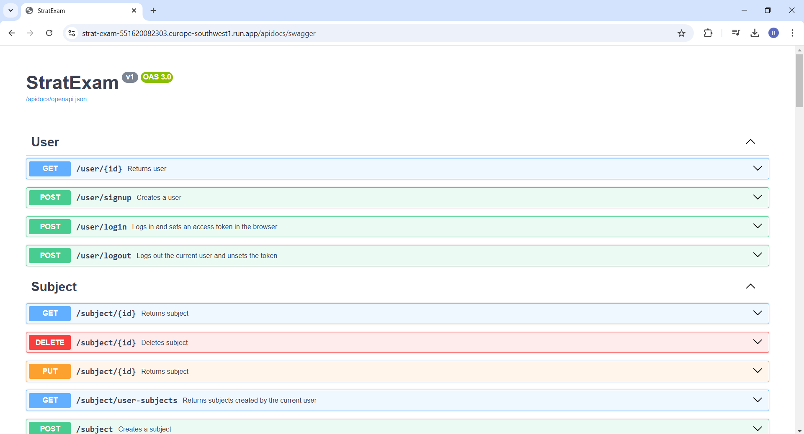

# Hito 5: Despliegue

## Objetivo

El objetivo de este hito es desplegar la aplicación en un servicio de PaaS,
y otras tareas relacionadas con el despliegue.


## Despliegue en Google Cloud

En primer lugar, debido a la estructura del proyecto, se ha decidido utilizar
Google Cloud, ya que es una plataforma de servicio en la nube bastante extendida. Es importante destacar que
se han valorado otras opciones como Amazon Web Services o Microsoft Azure, pero debido a experiencia en proyectos 
anteriores se ha elegido finalmente Google Cloud. Cabe destacar que se ha utilizado Google Cloud Run para alojar y 
ejecutar el proyecto, ya que era la manera más intuitiva y fácil para ofrecer el servicio en la nube de este proyecto. 
Una alternativa sería haber creado una Máquina Virtual de Google Cloud en la que se ejecutase el proyecto, pero esta 
alternativa es más cómoda e intuitiva, especialmente para integrar el proyecto mejor con Google Cloud. 

Para ello, después de realizar todos los pasos necesarios para tener la cuenta de Google Cloud preparada,
se ha creado un archivo secreto de claves con las credenciales de la Service Account de Google
para realizar el despliegue correctamente. A continuación, se ha creado el archivo `deploy.sh`, 
un script para automatizar el despliegue: 

- Establecer las variables necesarias para el script.
- Autenticarse con las claves de la cuenta de Google Cloud. 
- Configurar el proyecto.
- Habilitar los servicios de `googleapis.com` para poder acceder al servicio.
- Crear el repositorio de Artifact Registry en el que se alojarán los archivos del proyecto. 
- Autenticarse en Artifact Registry.
- Construir la imagen del Docker. 
- Desplegar en Google Cloud Run. 
- Obtener la URL base del servicio.
- Mostrar los logs del servicio.

Una vez realizados estos pasos, se recibe una URL, que en el caso de este proyecto es 
[https://strat-exam-551620082303.europe-southwest1.run.app](https://strat-exam-551620082303.europe-southwest1.run.app)

Al acceder a una ruta de este proyecto, como `/apidocs/swagger`, se puede comprobar que se recibe lo mismo que se 
recibía al ejecutar el proyecto localmente: 



## Despliegue automático con GitHub Actions

Es posible realizar un despliegue automático en GitHub Actions cada vez que se hace un push a la rama `main`. 
No obstante, como se puede apreciar al observar del archivo `deploy.sh` (o como se podría inferir del apartado 
anterior), algunos de los datos necesarios se encuentran en el archivo de claves `key.json`, que se encuentra
fuera del proyecto en GitHub por motivos evidentes de seguridad. 

No obstante, para realizar el despliegue automático sería suficiente con añadir una nueva acción al archivo 
`.github/workflows/python-app.yml` después de la realización de todos los tests, algo como lo siguiente:

````yml
 - name: Deployment in Google Cloud Run
   run: 
     chmod +x ./deploy.sh
     ./deploy.sh
````

De esta manera, se podría mantener actualizada la aplicación de forma automática; además, permitiría mantener la
versión anterior del proyecto en ejecución en caso de que la versión nueva no funcione bien, ya que sería necesario
que la versión pasase correctamente los tests para que se desplegara la nueva versión. 